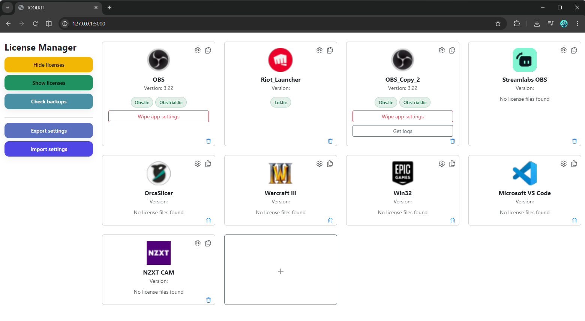
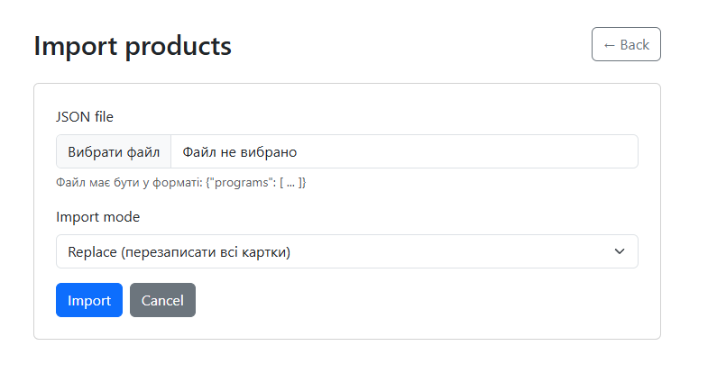
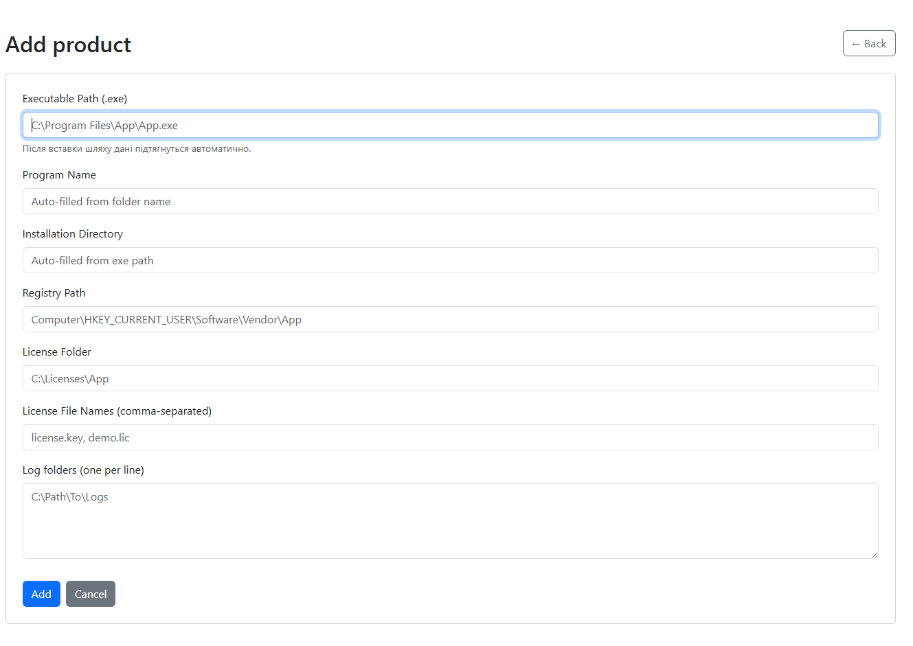

# QC Toolkit

QC Toolkit is a lightweight Windows QA toolbox for managing installed applications, license files, registry-related operations, and application settings through a simple local web interface.

The project was originally created as a diploma project and currently represents an early **V1 prototype** focused on practical QA/support workflows on Windows machines.

---

## Screenshots

### Main dashboard


### Import settings


### Add product


---

## Features

Current V1 functionality includes:

- Managing product cards
- Adding, editing and duplicating application entries
- Detecting configured license files
- Hiding and restoring license files without deleting them
- Basic Windows Registry related operations
- Importing and exporting application settings
- Local web interface for quick access to tools

This toolkit is designed for **local use on Windows systems** and does not transmit any data externally.

---

## Project Structure

```
QC_Toolkit/
│
├── app.py
├── requirements.txt
│
├── modules/
│   ├── __init__.py
│   ├── scanner.py
│   ├── license_ops.py
│   └── registry_ops.py
│
├── static/
├── templates/
└── screenshots/
```

## Example configuration (products.json)

QC Toolkit uses a JSON configuration file to define managed applications.

Below is a simplified example of how a program entry may look:

```json
{
  "programs": [
    {
      "id": "example_app",
      "name": "Example Application",
      "exe_path": "C:\\Program Files\\ExampleApp\\app.exe",
      "registry_path": "HKEY_CURRENT_USER\\Software\\ExampleApp",
      "directory": "C:\\Program Files\\ExampleApp",
      "license_folder": "C:\\Licenses",
      "license_names": [
        "example.lic",
        "trial.lic"
      ],
      "icon": "/static/icons/example.png",
      "log_folders": [
        "C:\\Logs\\ExampleApp"
      ]
    }
  ]
}
---

## Tech Stack

- Python 3.11+
- Flask
- Bootstrap 5
- Windows Registry API (`winreg`)
- Python standard library

---

## Platform

- Windows 10 / Windows 11  
- Local web interface (`localhost`)

---

## Run the project

Create virtual environment

```bash
python -m venv venv
```

Activate environment

```bash
venv\Scripts\activate
```

Install dependencies

```bash
pip install -r requirements.txt
```

Run application

```bash
python app.py
```

After launch open

```
http://127.0.0.1:5000
```

---

## Project Status

This repository contains an experimental **V1 version** of the toolkit.  
The project may evolve further with additional modules and features.

---

## 🇺🇦 Український опис

QC Toolkit — це локальний Windows-інструмент із веб-інтерфейсом для керування програмами, ліцензіями та частиною операцій із реєстром.

Проєкт створений у межах дипломної роботи та використовується як практичний інструмент для задач тестування та технічної підтримки.

Поточна версія — **V1 прототип**.

---

## Author

Mykola Chabanov  
Diploma project, 2025
